# AS Problem Collection

```sheet
| w23 | - | 11 | x | 21 | |
| ^ | - | 12 | x | 22 | |
| ^ | - | 13 | | 23 | |
| w22 | - | 11 | x | 21 | |
| ^ | - | 12 | x | 22 | |
| ^ | - | 13 | x | 23 | |
| w21 | - | 11 | x | 21 | |
| ^ | - | 12 | x | 22 | |
| ^ | - | 13 | | 23 | |
```

## 9701_w22_qp_12
### 18

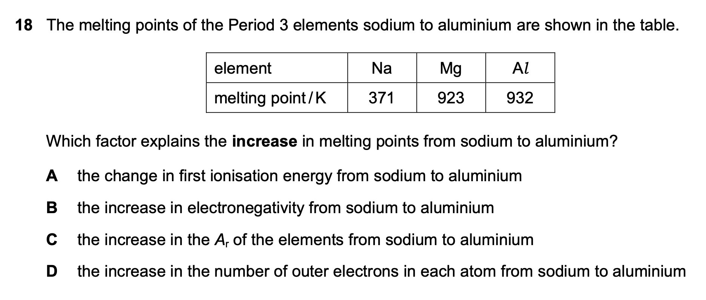

```sheet
| Wrong Ans | - | C |
| Correct Ans | - | D |
| Explain | - | The strength of metal bonds is decided by the number of delocalized electrons |
```


## 9701_w21_qp_12
### 11

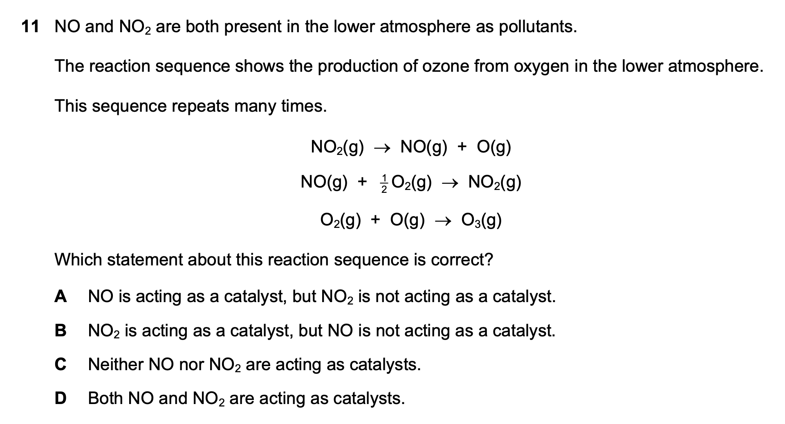

```sheet
| Wrong Ans | - | B |
| Correct Ans | - | D |
| Explain | - | Both are catalysts |
```

### 16

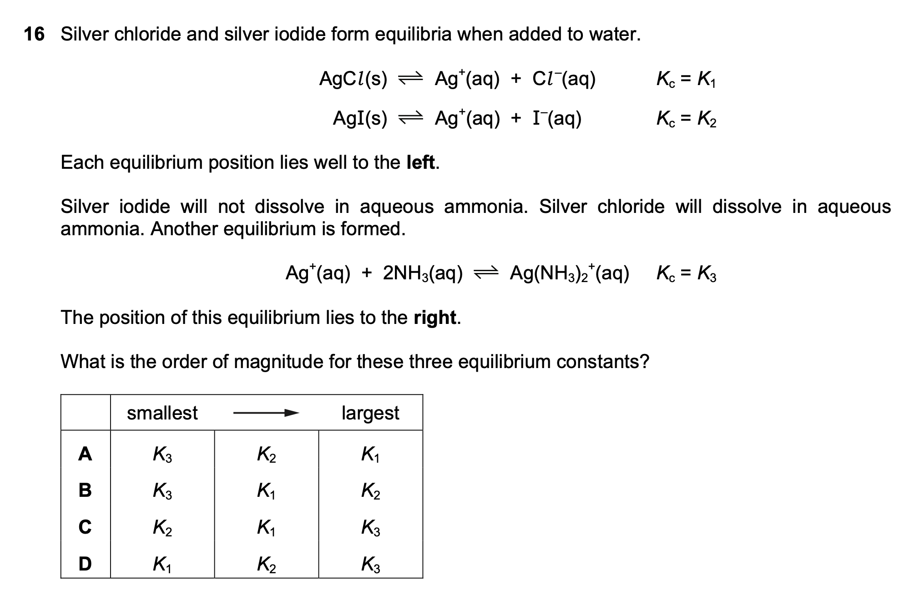

```sheet
| Wrong Ans | - | D |
| Correct Ans | - | C |
| Explain | - | $AgCl$ dissolves in ammonia to form $[Ag(NH_3)_2]^+$; $AgI$ does not solve in ammonia |
```

### 26

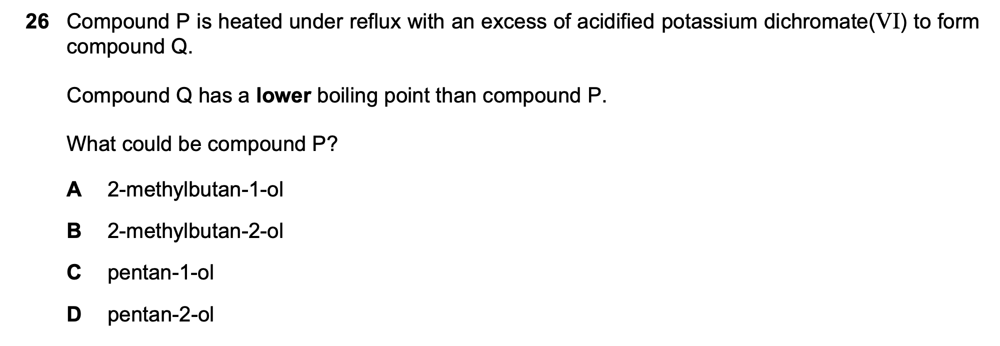

```sheet
| Wrong Ans | - | B |
| Correct Ans | - | D |
| Explain | - | Alcohol's corresponding carboxylic acid has stronger H-bond than itself. Aldehydes and ketones do not have H-bonds. |
```

### 29

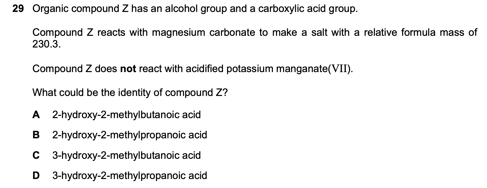

```sheet
| Wrong Ans | - | A |
| Correct Ans | - | B |
| Explain | - | $MgCO3$ only react with $-COOH$ |
```

### 31

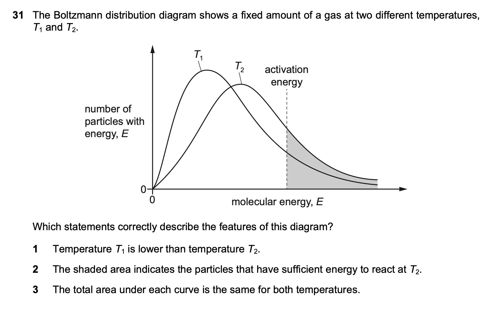

```sheet
| Wrong Ans | - | 1, 2 |
| Correct Ans | - | 1, 2, 3 |
| Explain | - | The total area represents the total number of particles |
```


## 9701_w23_qp_11

### 5

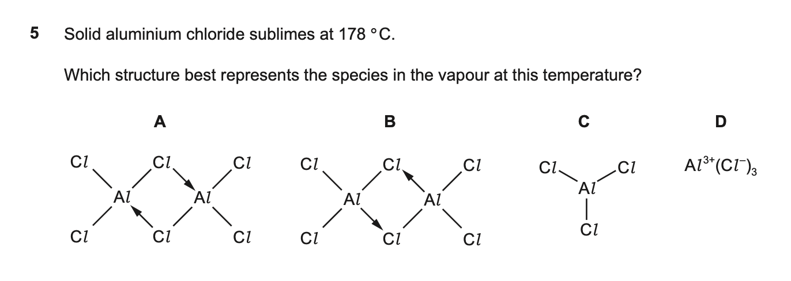

```sheet
| Wrong Ans | - | C |
| Correct Ans | - | A |
| Explain | - | As solid, $AlCl3$ forms giant lattice. As liquid and vapor (< 400℃), it forms $Al2Cl6$ dimer. As vapor (> 400℃), it forms $AlCl3$ monomer. |
```

### 16

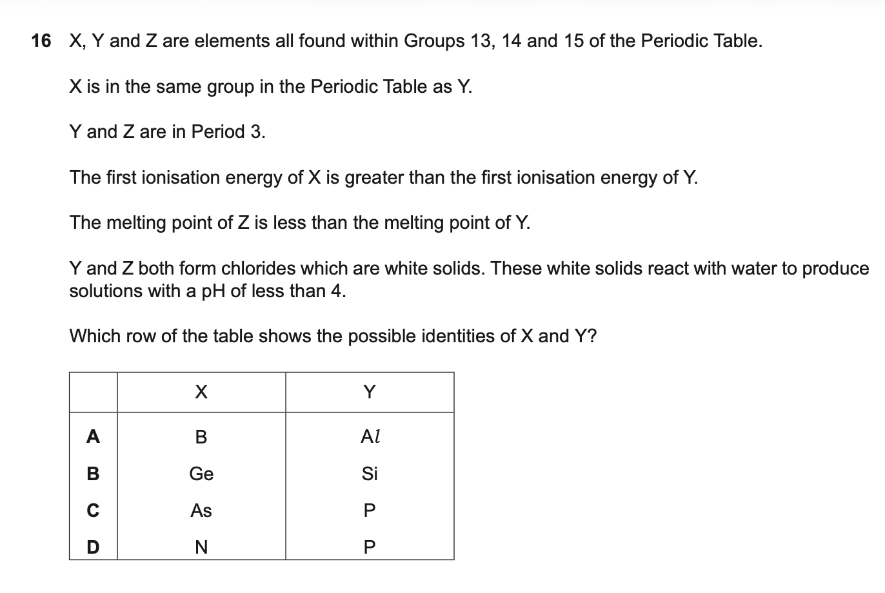

```sheet
| Wrong Ans | - | B |
| Correct Ans | - | A |
| Explain | - | $AlCl_3 + 3H_2O \rightarrow Al(OH)_3 + 3HCl$ |
```

Extra:

$SiCl_4 + 2H_2O \rightarrow 2SiO_2 + 4HCl$

$SiCl_4 + 4H_2O \rightarrow H_4SiO_4 + 4HCl$

## 9701_w22_qp_11

Ground state: lowest possible energy state

2NaBr+2H2​SO4​→Br2​+SO2​+Na2​SO4​+2H2​O

### 29

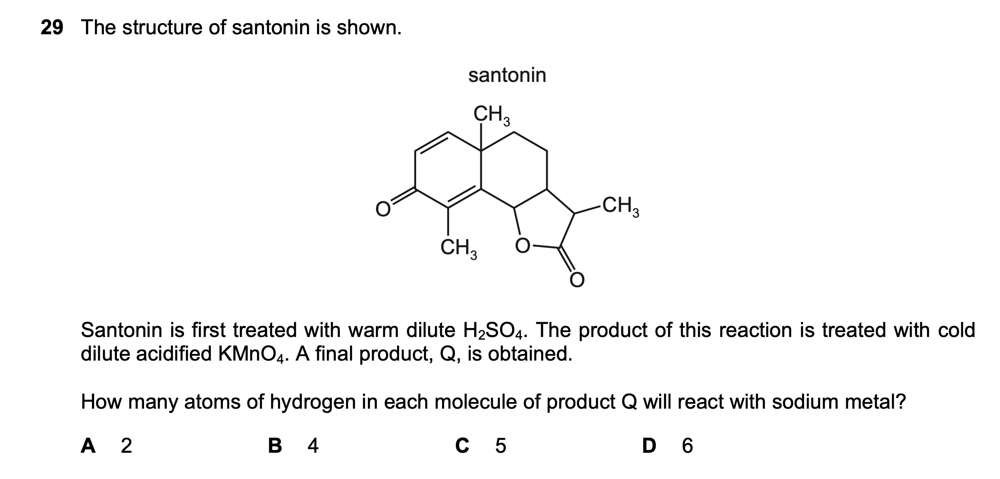

```sheet
| Wrong Ans | - | A |
| Correct Ans | - | D |
| Explain | - | $H_2SO_4$ opens $-COO-$ of the bottom right ring; $KMnO_4$ add OH to each end of $C=C$. $KMnO_4$ does not provide O so alcohol is not oxidized to aldehyde or ketone, but $K_2Cr_2O_7$ can |
```

### 32

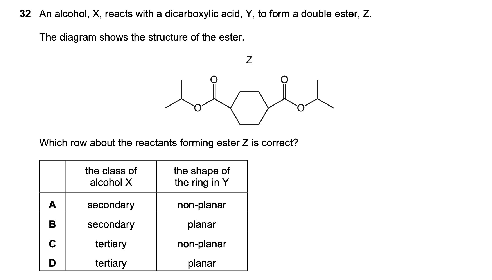

```sheet
| Wrong Ans | - | B |
| Correct Ans | - | A |
| Explain | - | Saturated hexane ring is not planar but twisted. Benzane ring is planar. |
```

## 9701_w21_qp_11

### 8

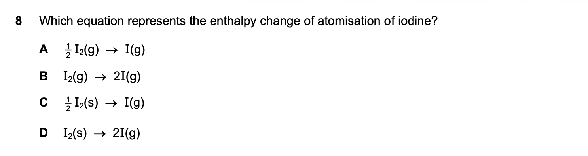
```sheet
| Wrong Ans | - | A |
| Correct Ans | - | C |
| Explain | - | Enthalpy change is analyzed under room condition (298 K + 100kPa) |
```

### 19

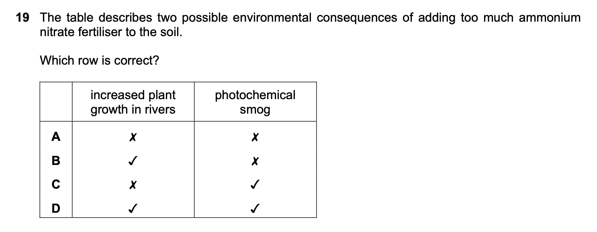
```sheet
| Wrong Ans | - | D |
| Correct Ans | - | B |
| Explain | - | Does not directly linked to the formation photochemical smog. Though, $NO_x$ + Volatile Organic Compounds $\xrightarrow{\text{sunlight}}$ photochemical smog. |
```


### 26

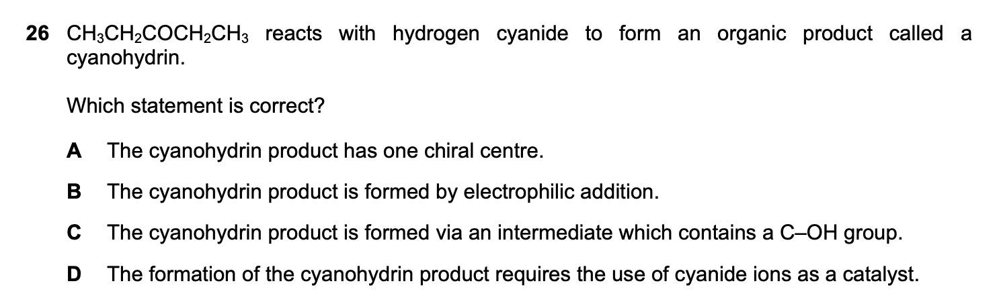

```sheet
| Wrong Ans | - | C |
| Correct Ans | - | D |
| Explain | - | The intermediate is $R_2C(O^-)CN$, with no $-OH$. |
```

## 9701_w23_qp_12

### 17

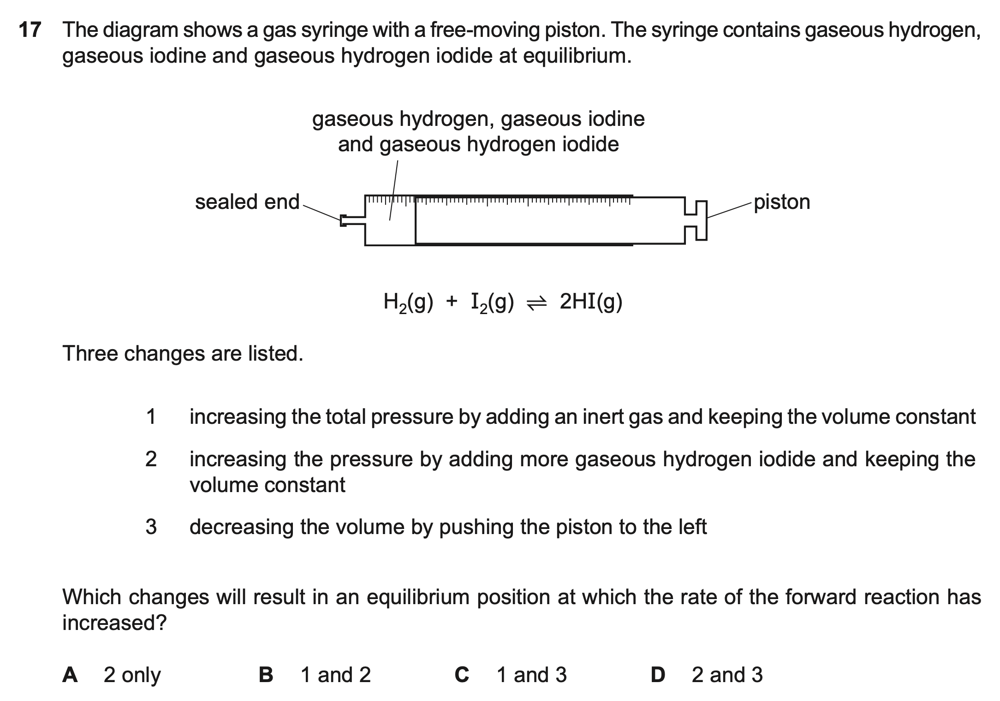

```sheet
| Wrong Ans | - | X |
| Correct Ans | - | 2, 3 |
| Explain | - | For 2 and 3, though the equilibrium moves to the left/does not move, the concentration increases, so the rate of change of the forward reaction increases. |
```

### 33

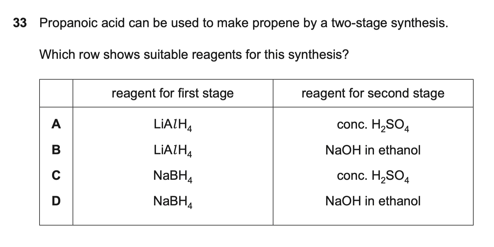

```sheet
| Wrong Ans | - | B |
| Correct Ans | - | A |
| Explain | - | NaOH(ethanol) can only be used in dehydrohalogenation, removing HX. To dehydrate, use conc. H₂SO₄. |
```

## Other Sources

### 1

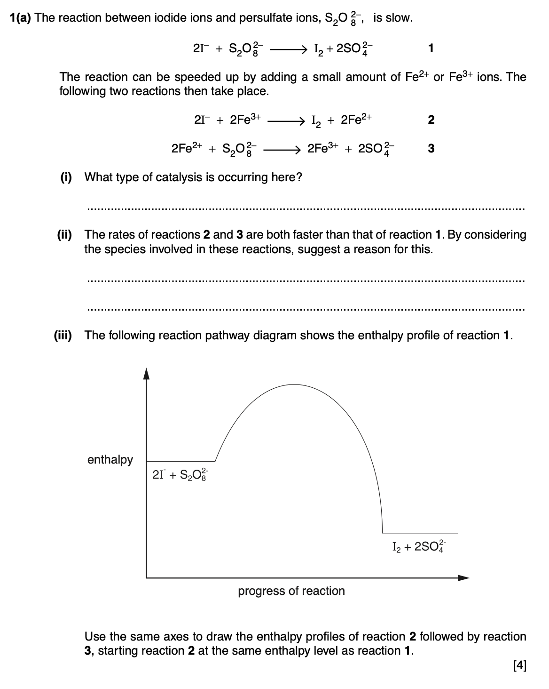

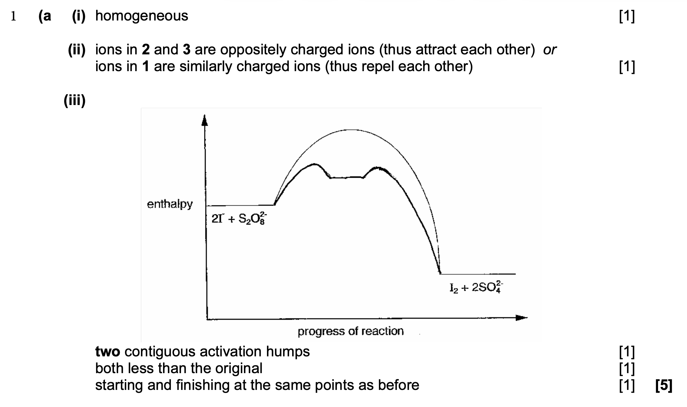
