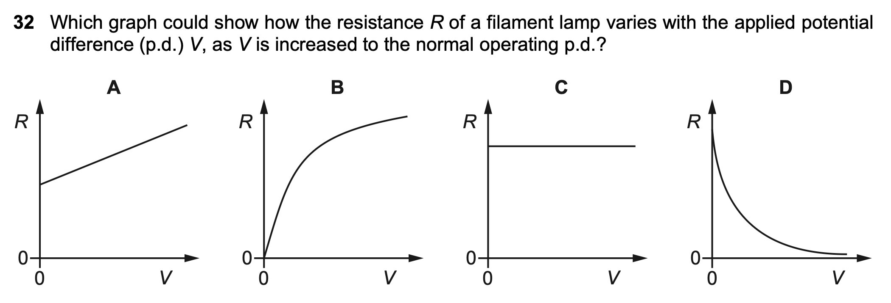

# AS Problem Collection

```sheet
| w23 | - | 11 | x | 21 | |
| ^ | - | 12 | | 22 | |
| ^ | - | 13 | | 23 | |
| w22 | - | 11 | | 21 | |
| ^ | - | 12 | | 22 | |
| ^ | - | 13 | | 23 | |
| w21 | - | 11 | | 21 | |
| ^ | - | 12 | | 22 | |
| ^ | - | 13 | | 23 | |
```

## 9701_w23_qp_11

### 32



```sheet
| Wrong Ans | - | B |
| Correct Ans | - | A |
| Explain | - | Though theoretically the relationship between R and V should not be linear, B's R is 0 when V is 0, which is impossible. Therefore, A would be the best answer. |
```
