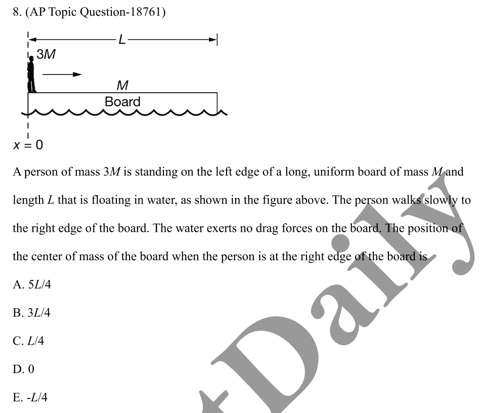
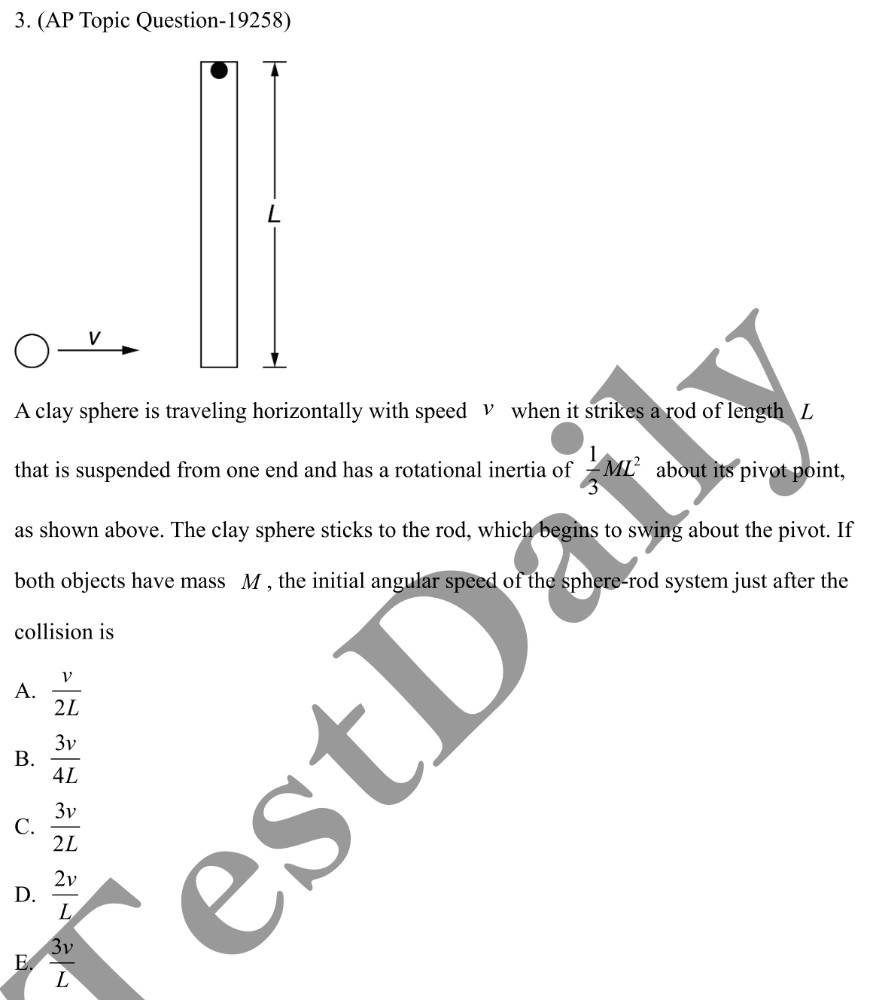

# AP Mechanics Problem Collection

## 1

Notice that there is 0 net external horizontal force acting on the board. Therefore, the entire system of board and person is in equilibrium. According to 

[Quick Guide from AS to AP Mechanics#Position of Center of Mass](./quick-guide-from-as-to-ap-mechanics.md#position-of-center-of-mass)

the coordinate of the center of mass of the system is fixed.

Before the person moves, $x_{com, sys} = \dfrac1{M + 3M} (\dfrac12 ML + M \cdot 0) = \dfrac18 L$.

After the person moves, the board will move to the left since the person will exert a leftward force to it. Denote the new coordinate of the center of mass of the board as $x_{com, b}$. Because the board has a uniform mass, the coordinate of the center of mass of the person is $x_{com, p} = x_{com, b} + \dfrac12 L$.

Because $x_{com, sys}$ is constant, $\dfrac18 L = \dfrac1{M + 3M} (x_{com, b} M + (x_{com, b} + \dfrac12 L) \cdot 3M)$. We can get $x_{com, b} = -\dfrac14 L$. $\fbox{E}$ is the answer.

## 2

Because the pivot of the rod will exert a non-negligible external force, the linear momentum of the system is not preserved. However, the rotational momentum is preserved. Therefore, we only analyze the rotational momentum.

Before collision, $L_0 = mrv = MLv$. After collision, $L_f = 2I\omega_f = \dfrac 2 3 ML^2\omega_f$. Since the rotational momentum is preserved, $L_0 = L_f \implies v = \dfrac 2 3 L \omega_f \implies \omega_f = \dfrac{3v}{2L}$. Therefore, $\fbox{C}$.