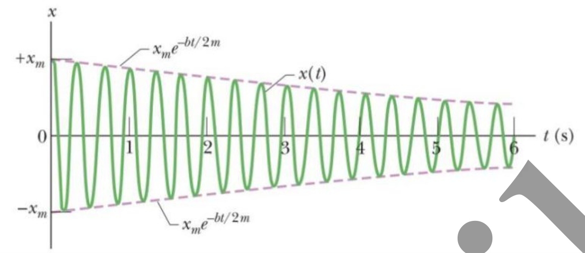
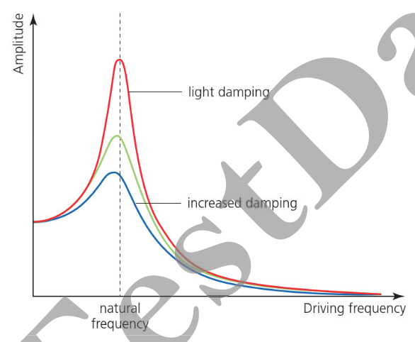

# Quick Guide from AS to AP Mechanics

## Unit 1: Kinematics

$v_{mid\ x} = \sqrt{\dfrac{v_0^2 + v_t^2}2}$

## Unit 2: Force & Translational Dynamics

### Resistive Force

**Turbulent Drag**:

$D = \dfrac{1}{2} C \rho A v^2$

- $C$: Drag coefficient < 1
- $\rho$: Fluid density
- $A$: Reference area
- $v$: Relative velocity to the fluid

Terminal velocity of free fall: $v_{\max} = \sqrt{\dfrac{2F_g}{C \rho A}}$

### Uniform Circular Motion

$\theta = \phi + \omega t$

$\vec{s} = (r \cos(\phi + \omega t), r \sin(\phi + \omega t))$

$\vec{v} = \dfrac{d\vec{s}}{dt} = (-r \omega \sin(\phi + \omega t), r \omega \cos(\phi + \omega t))$

$\vec{a} = \dfrac{d\vec{v}}{dt} = (-r \omega^2 \cos(\phi + \omega t), -r\omega^2 \sin(\phi + \omega t)) = - \omega^2 \vec{s}$

Therefore, $\vec{s}$ has the opposite direction to $\vec{a}$. $\vec{s}$ points out of the circle, and $\vec{a}$ points into the circle.

$a = \omega^2 r = \dfrac{v^2}r$

### General Circular Motion

$\vec{s} = (r\cos\theta, r\sin\theta)$

$\vec{v} = (-r \omega \sin\theta, r \omega \cos\theta)$, where $\omega = \dfrac{d\theta}{dt}$

### Gravitation Force

$\vec{F} = - G \dfrac{m_1m_2}{r^2} \cdot \hat{r}$, where $\hat{r}$ is the Unit Direction Vector of the radius direction.

### Gravitation Inside

For a shell, its gravitational force to an object inside it is 0. Therefore, we only need to calculate the sub sphere inside the object to find out the gravitation.

### Position of Center of Mass

For a line with n discrete particles, $x_{com} = \dfrac1M \sum\limits_{i=1}^n m_i x_i$, same for $y_{com}$ and $z_{com}$

The position of the center of mass is fixed when the object is at equilibrium.

> The velocity of the center of mass tells the velocity of a specific point. Since the net external force is zero, the velocity of that specific point cannot change. Therefore, the center of mass is fixed.
>
> Notice that the center of mass does not change **relative to the inertial frame of reference** but not the relative position to the object itself. This is because we measure the velocity relative to the frame of reference but not a point on the object. The center of mass can change its relative position on the object if the object moves, but not relative to the frame of reference.
>
> To understand this point, check [AP Mechanics Problem Collection#1](./mechanics-problem-collection.md#1).

## Unit 3: Work, Energy, and Power

### Potential Energy

$\Delta U = - W = - \int \vec{F} \cdot d\vec{r}$

$\implies U(r) - U(\infty) = U(r) = - \int_\infty^r \vec{F} \cdot d \vec{r}$

### Conservative Force

- A force that does zero net work over a closed path. It is path-independent and can be described by a potential energy function.

Because the path does not matter to the work done by a conservative force, we can determine the force at each point as $F(x) = - \dfrac{dU(x)}{dx}$, where $U(x)$ denotes the potential energy.

### Conservation of Mechanical Energy

- In a system, if only conservative forces are doing work, the mechanical energy of the system conserves.

## Unit 4: Linear Momentum

### Law of Motion for the Center of Mass

$v_{com} = \dfrac1M \sum\limits_{i=1}^N m_iv_i$

$a_{com} = \dfrac1M \sum\limits_{i=1}^N m_ia_i$

### Linear Momentum

Without external forces, the linear momentum is conserved.

### Impulse

> The change in an object's momentum caused by a net external force acting over a specific time interval

$J = \int_{t_i}^{t_f} F_{net}(t) dt = \Delta P$

### Elastic & Inelastic Collision

Besides elasticity, a collision can also be categorized as a frontal or a oblique collision.

If a collision is perfectly inelastic, two objects will have the same terminal velocity.

If a collision is perfectly elastic and frontal, the absolute value of the velocity difference is the same before and after the collision. When the masses of two are equal as well, two objects will swap velocity.

### Systems with Varying Mass

To analyze a flying rocket:

$Mv = dM (v-v_{rel}) + (M-dm)(v+dv)$, where $v_{rel}$ is the relative velocity of between the rocket and the propellent (direction backward), and $dM$ is the mass of propellent exhausted.

$-dM \cdot v_{rel} = M \cdot dv$

To calculate thrust $R$:

$- \dfrac{dM}{dt} \cdot v_{rel} = M \cdot \dfrac{dv}{dt} = Ma = R$

$\implies R = - \dfrac{dM}{dt} v_{rel}$

To calculate the change in the velocity of the rocket $\Delta v$:

$dv = -  v_{rel} \cdot \dfrac{1}{M} dM$

$\implies \Delta v = \int_{v_0}^{v} dv = - v_{rel} \cdot \int_{M_0}^{M} \dfrac{1}{M} dM$

$\implies \Delta v = - v_{rel} \cdot \ln(\dfrac{M}{M_0}) = v_{rel} \cdot \ln(\dfrac{M_0}{M})$

We can see that the more $\Delta M$ is, the larger the $\Delta v$ is.

## Unit 5: Torque & Rotational Dynamics

### Angular Position

Angular position $\theta$ is the orientation of an object relative to a fixed reference axis during rotational motion. $\theta = \dfrac{s}{r}$, where $s$ is the arc length and $r$ is the radius.

A counterclockwise angular displacement is positive.

### Angular Velocity & Acceleration

Angular velocity $\omega = \dfrac{\Delta \theta}{\Delta t}$, with unit $s^{-1}$

$v = \omega r$

Angular acceleration $\alpha = \dfrac{\Delta \omega}{\Delta t}$, with unit $s^{-2}$

$a = \alpha r$

### Rotation Kinematics

The equations are the same to linear kinematics:

- $\omega = \omega_0 + \alpha t$
- $\theta = \omega_0t + \dfrac12 \alpha t^2$
- $\theta = \omega t - \dfrac12 \alpha t^2$
- $2\alpha \theta = \omega^2 - \omega_0^2$
- $\omega = \dfrac{(\omega_0 + \omega) t}2$

### Kinetic Energy of Rotation

$K = \sum \dfrac12 mv^2 = \sum \dfrac12 m(\omega r)^2$

Notice that $\sum mr^2$ is a constant. Denote $I = \sum mr^2 = \int r^2 dm$, where $I$ is the moment of inertia. Therefore,

$K = \dfrac12 I \omega^2$

### Moment of Inertia

$I = \sum mr^2 = \int r^2 dm$

To infer the formula of the moment of inertia of an object, we need to transform $dm$ to $density(\theta) \cdot dl$. Let us take a ring for instance:

Take a point on the ring with mass $dm$, $dm = \lambda dl$, where $\lambda$ is the linear density and $dl$ is the width of that line. Therefore, $\Delta I = r^2 \lambda dl$. $I = \int \Delta I = \int_0^{2\pi r} r^2 \lambda dl = r^2 m$, as $\int_0^{2\pi r} \lambda dl = m$.

> To quickly compare the moment of inertia for objects with the same mass but different shapes, we can apply the **Mass Concentration Rule**:
>
> The **farther** the mass is pushed away from the axis of rotation, the **larger** its moment of inertia is.

### Parallel Axis Theorem

The moment of inertia of an object rotating at an axis deviating to its center of mass can be calculated as $I = I_{com} + md^2$, where $d$ is the distance between the rotating axis and its parallel axis across the center of mass.

### Torque

Torque $\tau = F_r \cdot r = \vec{F} \times \vec{r}$, where $F_r$ is vertical to the line vertical to the rotation axis crossing through the point where the force is applied to.

$\tau = F_r \cdot r = ma \cdot r = m \alpha r \cdot r = mr^2 \cdot \alpha = I\alpha$

## Unit 6: Energy & Momentum of Rotating Systems

### Kinetic Energy of An Rigid System

$K = K_{trans} + K_{rot} = \dfrac12 mv^2 + \dfrac12 I \omega^2$

Only when rolling without slipping, $v = \omega r$ and $a = \alpha r$

### Rotation Work

$W = \dfrac12 I (\omega^2 - \omega_0^2) = \tau \cdot d\theta$

$P = \dfrac{dW}{dt} = \tau \omega$

### Angular Momentum & Impulse

Angular momentum $\vec{L} = \vec{r} \times \vec{p} = m \vec{r} \times \vec{v}$ or $L = mrv\sin\theta$, where $\vec{p}$ is the linear momentum, and $\vec{r}$ is the position vector relative to the reference point.

$\vec{\tau} = \dfrac{\vec{L}}{dt}$

Total momentum $\vec{L}_{tot} = \sum \vec{r} \times \vec{v}$

$\implies \dfrac{d\vec{L}_{tot}}{dt} = \sum \vec{r} \times \vec{F}_{net} = \vec{\tau}_{net, ext}$

Therefore, if the net external torque of a system is zero, the total angular momentum is preserved.

> The conservation of angular momentum and linear momentum is independent. There is no such conservation of ($L$ + $p$).

For a system rotating at a fixed axis, we only need to consider the angular momentum around the axis. Therefore:

$L = \sum mr_{per}v = \sum mr^2_{per}\omega = I \omega$, where $r_{per}$ is the vertical distance between each point to the rotation axis.

Angular impulse $\Delta L = \int_{t_1}^{t_2} \tau_{net} dt$

### Motion of Orbiting Satellites

$v = \sqrt{\dfrac{GM}{r}}$

$\omega = \sqrt{\dfrac{GM}{r^3}}$

$T^2 MG = 4 \pi^2 r^3$

### Potential Energy of Orbiting Satellites

$\vec{F}\cdot d\vec{r} = - G \dfrac{Mm}{r^2} dr$

$\implies U(r) = - \int_\infty^r (-G\dfrac{Mm}{r^2}) dr = GMm \int_\infty^r \dfrac{1}{r^2} dr = - G \dfrac{Mm}r$

$K = \dfrac12 mv^2 =  G\dfrac{Mm}{2r}$

$K_{tot} = -G\dfrac{Mm}{2r}$

### Linear-to-Angular Translation

| Linear                               | Angular                                              |
| ------------------------------------ | ---------------------------------------------------- |
| Mass $m$                             | Rotational Inertia $I$                               |
| Velocity $v$                         | Angular Velocity $\omega$                            |
| Acceleration $a$                     | Angular Acceleration $\alpha$                        |
| Force $F$                            | Torque $\tau$                                        |
| Kinetic Energy $K = \dfrac{1}{2}mv^2$ | Rotational Kinetic Energy $K = \dfrac{1}{2}I\omega^2$ |
| Work $W = \Delta K$                  | Rotational Work $W = \Delta K$                       |
| Momentum $p$                         | Rotational Momentum $L$                              |

## Unit 7: Oscillations

### Steps to Solve Simple Harmonic Motion

> You may first read the sections below that come back to this. Though the formulas in the sections may appear to be complex and scary, they can be mostly solved in the following step.

| Step | Action                              | Linear Equation              | Angular Equation                    |
| ---- | ----------------------------------- | ---------------------------- | ----------------------------------- |
| 1    | Identify the restoring force/torque | $F_{net}$                    | $\tau_{net}$                        |
| 2    | Relate it to displacement           | $F_{net} = -kx$              | $\tau_{net} = - \kappa \theta$      |
| 3    | Use Newton's 2nd Law                | $a = - \dfrac{k}m x$         | $\alpha = - \dfrac{\kappa}I \theta$ |
| 4    | Identify $\omega^2$                 | $a = - \omega^2 x$           | $\alpha = -\omega^2 \theta$         |
| 5    | Extract $\omega$                    | $\omega = \sqrt{\dfrac k m}$ | $\omega = \sqrt{\dfrac \kappa I}$   |
| 6    | State the period                    | $T = \dfrac{2\pi}\omega$     | $T = \dfrac{2\pi}\omega$            |

### Dynamics of Horizontal Spring-Block Oscillator

According to Hooke's Law, the restoring force $F_s = -kx = ma = m \dfrac{d^2x}{dt^2}$

$\dfrac{d^2x}{dt^2} = -\dfrac k m x$. Since $\omega = \sqrt{\dfrac k m}$ is the angular frequency of the oscillator, $\dfrac{d^2x}{dt^2} = - \omega^2 x$

One solution of the above equation is:

$x = A cos(\omega t)$

$v = \dfrac{dx}{dt} = -A\omega\sin(\omega t)$. When $\omega t=\dfrac\pi 2$, $v$ has its maximum value.

$a = \dfrac{dv}{dt} = -A\omega^2 \cos(\omega t) = -\omega^2 x$

$T = \dfrac{2\pi}{\omega} = 2\pi \sqrt{\dfrac m k}$

### Energy of Horizontal Spring-Block Oscillator

$K = \dfrac 1 2 mv^2 = \dfrac 1 2 m (-A \omega \sin(\omega t))^2 = \dfrac 1 2 m A^2 \omega^2 \sin^2(\omega t)$

When $U = 0$, $K$ has its maximum value of $\dfrac 1 2 mA^2 \omega^2$

$U = \dfrac 1 2 kx^2 = \dfrac 1 2 k (A \cos(\omega t))^2 = \dfrac 1 2 kA^2 \cos^2(\omega t)$

When $K = 0$, $U$ has its maximum value of $\dfrac 1 2 k A^2$

Total energy $E = K + U = \dfrac 1 2 m A^2 \omega^2 \sin^2(\omega t) + \dfrac 1 2 kA^2 \cos^2(\omega t)$. Since $\omega^2 = \dfrac k m$, $m \omega^2 = k$,

$E = \dfrac 1 2 kA^2(\sin^2(\omega t) + \cos^2(\omega t)) = \dfrac 1 2 k A^2$

Therefore, the energy of the oscillator conserves.

### Inclined Spring-Block Oscillator

All equations are the same to horizontal spring-block oscillator.

### Torsion Pendulum

$\dfrac{d^2\theta}{dt^2} = - \omega^2 \theta$, where $\omega = \dfrac K I$, $K$ is the torsion constant.

One solution of the above equation is:

$\theta = A \cos(\omega t)$

$\Omega = \dfrac{d\theta}{dt} = -A\omega\sin(\omega t)$

$\alpha = \dfrac{d\Omega}{dt} = -\omega^2 \theta$

$T = 2\pi \sqrt{\dfrac I K}$

### Simple Pendulum

Because $\theta$ is small, $\sin(\theta) = \theta$

$\tau = - L mg \theta = -K\theta$, where $K = Lmg$

$T = 2\pi \sqrt{\dfrac L g}$

### Physical Pendulum

Because $\theta$ is small, $\sin(\theta) = \theta$

$r = -mg \sin(\theta) h = -mg\theta h$

$\alpha = - \dfrac{mgh}{I} \theta = - \omega \theta$, where $\omega = \sqrt{\dfrac{mgh}{I}}$

$T = 2\pi \sqrt{\dfrac I {mgh}}$

### Damped Simple Harmonic Motion

### Forced Oscillations & Resonance

