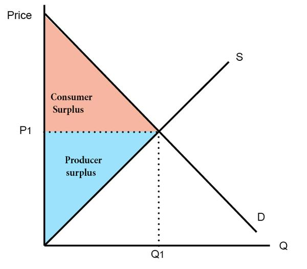

## Supply Curve

### Determinants of Supply

The supply curve illustrates how the quantity supplied responds to changes in various factors. Below is a breakdown of the determinants:

| Determinants         | Effect on Curve               |
|----------------------|-------------------------------|
| Price                | Move along curve (no shift)   |
| Input price          | Shift curve                   |
| Technology           | Shift curve                   |
| Expectations         | Shift curve                   |
| Number of sellers    | Shift curve                   |

!!! note
    When price decreases while income remains constant, consumers' purchasing power increases.

## Elasticity Concepts

### Price Elasticity of Demand (PED)

**Formula**:

$$
PED = \frac{\Delta \text{Quantity Demanded\%}}{\Delta \text{Price\%}}
$$
$$
PED \in [0, +\infty)
$$

#### Types of Price Elasticity of Demand

- **Perfectly Elastic Demand**
  $PED = \infty$: The demand curve is a horizontal line.
  
- **Relatively Elastic Demand**  
  $PED > 1$: Percentage change in quantity demanded exceeds percentage change in price ($\Delta QD\% > \Delta P\%$).

- **Unit Elastic Demand**  
  $PED = 1$: Percentage change in quantity demanded equals percentage change in price ($\Delta QD\% = \Delta P\%$).

- **Relatively Inelastic Demand**  
  $0 < PED < 1$: Percentage change in quantity demanded is less than percentage change in price ($\Delta QD\% < \Delta P\%$).

- **Perfectly Inelastic Demand**  
  $PED = 0$: The demand curve is a vertical line.

#### Total Revenue and Elasticity

$$
TR = P \cdot Q
$$

- $Price \propto TR \implies \text{Inelastic}$
- $Price \propto \frac{1}{TR} \implies \text{Elastic}$
- $Price = C \implies \text{Unit Elastic}$

---

### **2.2 Price Elasticity of Supply (PES)**

**Formula**:

$$
PES = \frac{\Delta \text{Quantity Supplied\%}}{\Delta \text{Price\%}}
$$
$$
PES \in [0, +\infty)
$$

#### Simple Formula

- $\Delta \text{Quantity Supplied\%} = \frac{Q_2 - Q_1}{Q_1}$
- $\Delta \text{Price\%} = \frac{P_2 - P_1}{P_1}$

#### Mid-Point Formula

- $\Delta \text{Quantity Supplied\%} = \frac{Q_2 - Q_1}{\frac{Q_2 + Q_1}{2}}$
- $\Delta \text{Price\%} = \frac{P_2 - P_1}{\frac{P_2 + P_1}{2}}$

#### Types of Price Elasticity of Supply

- **Perfectly Elastic Supply**  
  $PES = \infty$: The supply curve is a horizontal line.
  
- **Relatively Elastic Supply**  
  $PES > 1$: Percentage change in quantity supplied exceeds percentage change in price ($\Delta QS\% > \Delta P\%$).

- **Unit Elastic Supply**  
  $PES = 1$: Percentage change in quantity supplied equals percentage change in price ($\Delta QS\% = \Delta P\%$).

- **Relatively Inelastic Supply**  
  $0 < PES < 1$: Percentage change in quantity supplied is less than percentage change in price ($\Delta QS\% < \Delta P\%$).

- **Perfectly Inelastic Supply**  
  $PES = 0$: The supply curve is a vertical line.

---

### 2.3 Income Elasticity of Demand (YED)

Formula**:
$$
YED = \frac{\Delta \text{Quantity\%}}{\Delta \text{Income\%}}
$$

- $YED > 0 \implies \text{Normal Good}$
- $YED < 0 \implies \text{Inferior Good}$

---

### 2.4 Cross-Price Elasticity of Demand (XED)

**Formula**:

$$
XED = \frac{\Delta \text{Quantity\% of X}}{\Delta \text{Price\% of Y}}
$$

- $XED > 0 \implies \text{Substitutes}$
- $XED < 0 \implies \text{Complements}$

---

## Market Equilibrium

### Equilibrium Price

The equilibrium price is the point where the **Demand Curve** and **Supply Curve** intersect.

### Changes in Supply and Demand

| | No Change in Supply | Increase in Supply | Decrease in Supply |
|-----------------------|---------------------|--------------------|--------------------|
| **No Change in Demand** | $P=$, $Q=$         | $P \downarrow$, $Q \uparrow$ | $P \uparrow$, $Q \downarrow$ |
| **Increase in Demand**  | $P \uparrow$, $Q \uparrow$ | $P ?$, $Q \uparrow$ | $P \uparrow$, $Q ?$ |
| **Decrease in Demand**  | $P \downarrow$, $Q \downarrow$ | $P \downarrow$, $Q ?$ | $P ?$, $Q \downarrow$ |

---

## Consumer and Producer Surplus

### Consumer Surplus

- **Willingness to Pay (WTP)**: The maximum price a consumer is willing to pay for a good or service.
- **Marginal Buyer**: The consumer who leaves the market first if the price rises further.

$$
\text{Consumer Surplus} = \text{Willingness to Pay} - \text{Actual Price}
$$

### Producer Surplus

- **Marginal Seller**: The producer who leaves the market first if the price decreases further.

$$
\text{Producer Surplus} = \text{Actual Price} - \text{Cost}
$$

### Total Surplus

$$
\text{Total Surplus} = \text{Consumer Surplus} + \text{Producer Surplus}
$$

---

## Government Intervention in Markets

### Price Ceiling

- Effective only when actual price > price ceiling.
- Causes a shortage:  
  $$
  \text{Shortage} = QD - QS
  $$
- Protects consumers.

### Price Floor

- Effective only when actual price < price floor.
- Causes a surplus:  
  $$
  \text{Surplus} = QS - QD
  $$
- Protects producers.

### Taxes

- Tax burden depends on elasticity:  
  $$
  \text{Inelastic} \implies \text{Higher tax burden}
  $$
- Size of tax:  
  $$
  \text{Size of Tax} = \text{Price of Demand} - \text{Price of Supply}
  $$
- Tax revenue:  
  $$
  \text{Tax Revenue} = T \cdot Q
  $$

#### Impact of Taxes on Surplus

| | Without Tax        | With Tax           | Change             |
|---------------------|--------------------|--------------------|--------------------|
| **Consumer Surplus** | $A + B + C$       | $A$               | $-(B + C)$        |
| **Producer Surplus** | $D + E + F$       | $F$               | $-(D + E)$        |
| **Tax Revenue**      | None              | $B + D$           | $+(B + D)$        |
| **Total Surplus**    | $A + B + C + D + E + F$ | $A + B + D + F$ | $-(C + E)$        |

