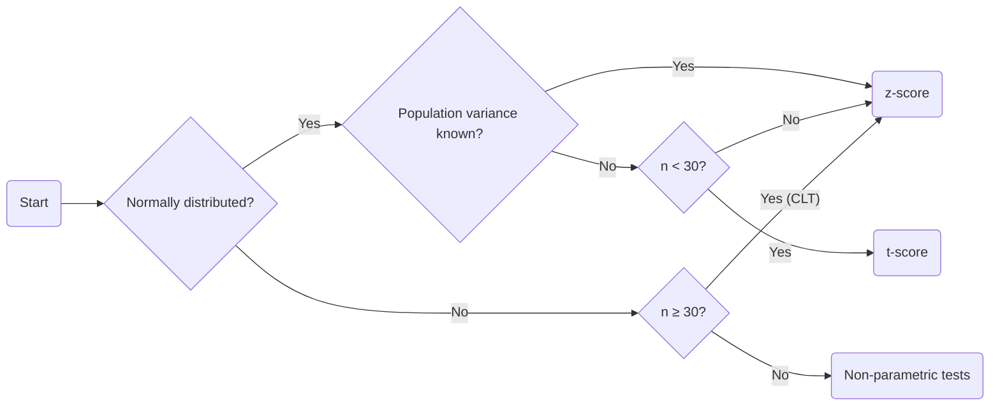

## t-Distribution

### What Is t-Distribution

> A continuous probability distribution similar to the normal distribution
>
> - The tails are thicker $\implies$ more chances of getting extreme values

- **Degrees of freedom**, dof
	- $\uparrow$ dof $\implies$ peak sharper and tails thinner $\implies$ closer to normal distribution
- $\mu = 0$
- $\sigma > 1$, closer to 1 as dof increases

### When Is t-Distribution Used

- $\sigma$ is unknown and population is approximately normally distributed
- $n < 30$
- t-distribution can be used to
	1. Perform hypothesis tests for $\mu$
	2. Form confidence intervals for $\mu$

## Hypothesis Tests for Population Means

### One-Sample t-test for Mean

> Test whether the population mean of a normally distributed population has changed
> 
> $\sigma$ is unknown

### Conditions for One-Sample t-test

- If the population is very skewed, a t-test can only be done when $n \geq 30$

### Calculate t-value

- $t = \dfrac{\overline{x} - \mu}{standard\ error}$
- $standard\ error = \dfrac{s}{\sqrt{n}}$

### Calculate dof

- $dof = n-1$, if there are multiple $n$, choose the smallest one.

## For Differences in Population

- $standard\ error = \sqrt{\dfrac{s_A^2}{n_A} + \dfrac{s_B^2}{n_B}}$

## t-scores VS z-scores

## Paired t-test

> Test whether or not the population means of  two pieces of data that are linked are equal by examining the differences between paired data

- The data for a two-sample t-test is from  two independent populations
- The data for a paired t-test is linked and come from one population

- Use $d$ for the difference of two measures. For instance, $\mu_d$

### Calculate t-value

$t  = \dfrac{\overline{x_d} - \mu_d}{\frac{s_d}{\sqrt{n}}}$