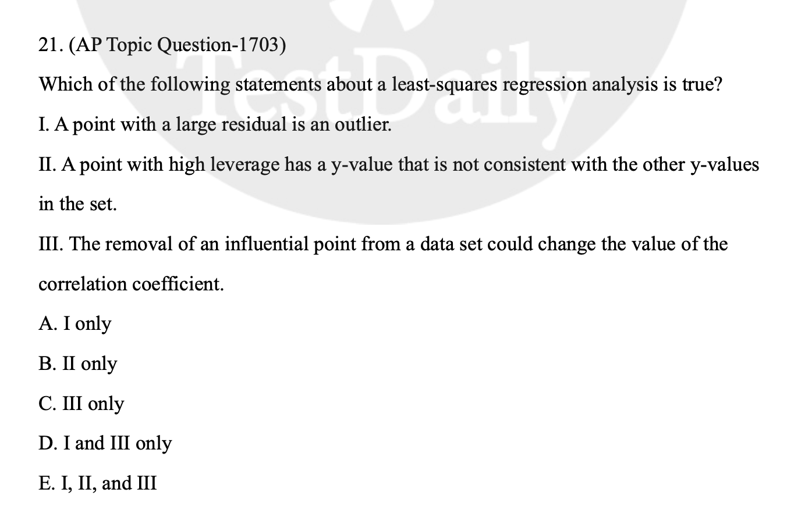

# AP Statistics Problem Collection

## MCQ

### 1



```sheet
| Wrong Ans | - | D |
| Correct Ans | - | C |
| Explain | - | All of the sample points can have vary large residuals, but they are not outliers as long as they are within the variation of the regression lines. |
```
