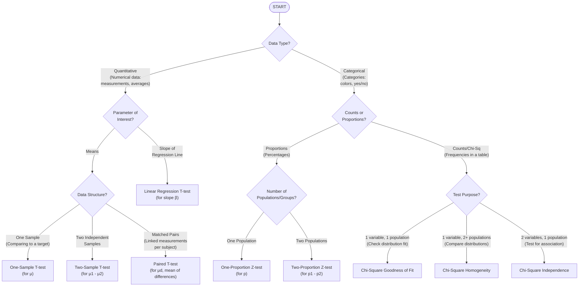

# Determine Tests

```mermaid
graph TD;
    %% --- MAIN FLOW ---
    A(["START"]) --> Q1{"Data Type?"}
    
    Q1 -- "Quantitative<br/>(Numerical data:<br/>measurements, averages)" --> Q1_Quan{"Parameter of<br/>Interest?"};
    Q1 -- "Categorical<br/>(Categories:<br/>colors, yes/no)" --> Q1_Cat{"Counts or<br/>Proportions?"};

    %% --- Quantitative Data Path ---
    Q1_Quan -- "Means" --> Q2_Quan_Mean{"Data Structure?"};
    Q1_Quan -- "Slope of<br/>Regression Line" --> TestSlope["Linear Regression T-test<br/>(for slope β)"];

    Q2_Quan_Mean -- "One Sample<br/>(Comparing to a target)" --> TestOneM["One-Sample T-test<br/>(for μ)"];
    Q2_Quan_Mean -- "Two Independent<br/>Samples" --> TestTwoM["Two-Sample T-test<br/>(for μ1 - μ2)"];
    Q2_Quan_Mean -- "Matched Pairs<br/>(Linked measurements<br/>per subject)" --> TestPairedM["Paired T-test<br/>(for μd, mean of differences)"];

    %% --- Categorical Data Path ---
    Q1_Cat -- "Proportions<br/>(Percentages)" --> Q1_Cat_Prop{"Number of<br/>Populations/Groups?"};
    Q1_Cat -- "Counts/Chi-Sq<br/>(Frequencies in a table)" --> Q1_Cat_Count{"Test Purpose?"};

    Q1_Cat_Prop -- "One Population" --> TestOneP["One-Proportion Z-test<br/>(for p)"];
    Q1_Cat_Prop -- "Two Populations" --> TestTwoP["Two-Proportion Z-test<br/>(for p1 - p2)"];

    Q1_Cat_Count -- "1 variable, 1 population<br/>(Check distribution fit)" --> TestChiGOF["Chi-Square Goodness of Fit"];
    Q1_Cat_Count -- "1 variable, 2+ populations<br/>(Compare distributions)" --> TestChiH["Chi-Square Homogeneity"];
    Q1_Cat_Count -- "2 variables, 1 population<br/>(Test for association)" --> TestChiI["Chi-Square Independence"];
```