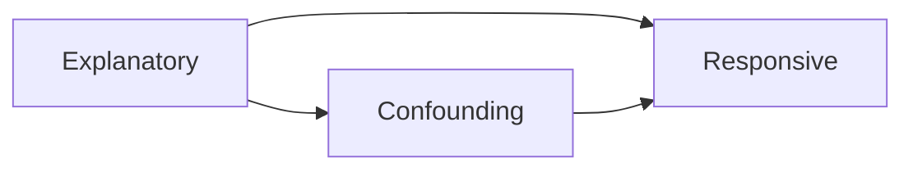

# Experimental Design

## Introduction to Experiments

### Experiments

Components:

- Experimental unit
- Treatment

Variables:

- Explanatory variable
- Responsive variable

### Observational Study

> Do **not influence** the individual

Types:

- Retrospective
	- Data is collected then analyzed
- Prospective
	- A sample is observed for a period of time into the future

## Well-Designed Experiments
### Confounding Variables

- In an experiment, confounding values need to be controlled.
- In an observational study, confounding values should not and cannot be controlled

### Well-Designed Experiments

- $\geq 2$ treatment groups (a control group counts)
- **Randomization**: Treatment groups are formed by randomly assigning treatments
- **Replication**: $\geq 1$ experimental unit per treatment group
- Confounding variables are controlled

## Control Groups, Placebos & Blind Experiments

### Control Groups

> A treatment group in an experiment that are purposefully given either
> 
> - an **inactive** form of the treatment
> - or the **pre-existing** treatment

### Placebo

> A dummy treatment that the experimental units believe is an active treatment

- Control groups can use placebos as inactive forms of treatment

> The placebo effect is the response made by experimental units to a placebo

### Blind Experiments

> A single-blind experiment is the one in which the **participants** do not know which treatment they are receiving

- Helps reduce the placebo effect

> A double-blind experiment is the one in which **participates and researchers** do not know which groups are assigned which treatments

- Helps reduce the placebo effect
- Reduce any bias

## Completely Randomized Design

> All experiment units are randomly assigned
>
> - Creates treatment groups that are as similar as possible
> - Helps balance out any effects of confounding variables across the groups

## Randomized Block & Matched Pairs Design

### Block

> A group of experimental units who have something in common that may affect how they respond to a treatment

- It should only be done if the researcher believes the blocking variable could affect the results
- Blocking allows natural variations in response to treatments to be distinguished from those variations that were due to the blocking variable

### Randomized Block Design

> 1. Experimental units are separated out into blocks
> 2. Experimental units are randomly assigned the different treatments **within each block**
> 3. Each block needs to be randomly assigned all of the treatments

- A randomized block design is generally better than a completely randomized design
- If blocking variables are unknown or the sample size is very large, completely randomized designs should be used
	- Larger samples tend to introduce more blocking variables
	- So each block has smaller sample size

### Matched Pairs Design

> - Each block has only two experiment units which are matched either naturally or manually based on some common factor
> - Two treatments

- A matched pairs design is better than completely random design
	- Easier to distinguish the effectiveness of the treatment